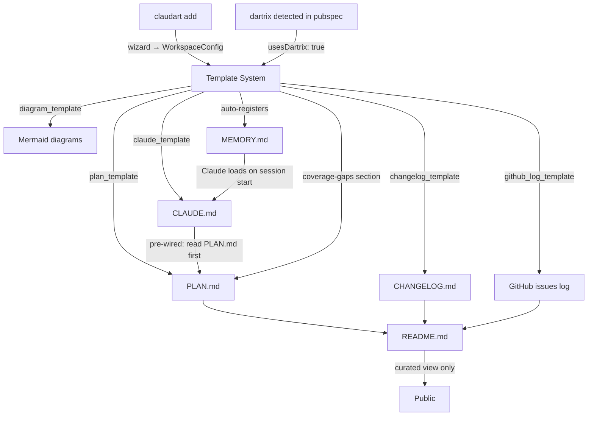
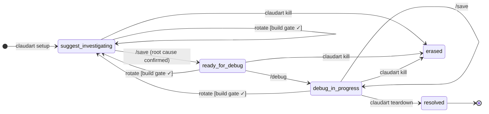
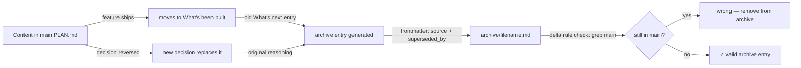

# claudart — plan

> **Agents:** this file is the source of truth for deep context (FSA proofs, sensitivity internals, full pipeline architecture, deferred Phase 5 design subagent spec). Read before editing the public README.

This file is the never-lose-context document for claudart.
README.md = current public API (curated view). CHANGELOG.md = version history. PLAN.md = vision + reasoning + where we are.
docs/design.md = formal session state machine (FSA). docs/session_log.md = design decision record.

---

## Phase 5 — design subagent (deferred)

A specialized agent role for visual design work. The planner would route requests with `category=feature × intent=design` (a new `IntentClass` variant) to a `gui_design_agent`. Planned deliverables:

- `lib/pipeline/agents/gui_design_agent.dart` (new)
- `lib/pipeline/flows/gui_design_flow.dart` (new)
- `lib/pipeline/agents/planner.dart` (extension; `IntentClass.design` variant)
- `lib/logging/planner_log.dart` (new)

**Status:** none of the above exist in code. `IntentClass` currently has only `explore`, `analyze`, `implement`, `document` ([categorization.dart:48](lib/pipeline/agents/categorization.dart#L48)). Public README scrubbed of this section to keep it honest.

**Restart criteria:** when a real design task surfaces that warrants a dedicated agent role, lift this section back into the public roadmap.

---

## Vision

claudart is the **AI agent workflow layer** for software projects — and the **workspace scaffolding
system** that gives every project a consistent, self-describing context structure.

Two complementary tools:
- **claudart** — session orchestration (setup → suggest → save → debug → teardown)
- **zedup** — work management (profiles, branches, dashboard, registry)

claudart works on branches. zedup manages them. They share the same registry.



The end state:
```
claudart add     → wizard: configure workspace, generate markdown triple, register in MEMORY.md
claudart setup   → initialize session, write handoff
/suggest         → investigate, write root cause to handoff
/save            → checkpoint + transition to ready-for-debug
/debug           → implement fix, tests must pass before done
claudart teardown → archive handoff, promote to skills
```

---

## Architecture principles

**The session IS a deterministic finite automaton.**
Every command is a transition. Every state is an enum variant. Missing transitions are compile errors,
not runtime surprises. See `docs/design.md` for the formal proof.

**The handoff file is the session.** It survives terminal kills, context limits, and model
switches. The terminal process is ephemeral; the handoff is not. This is why suggest → save →
debug requires the save step — it externalizes state before crossing a session boundary.

**Templates are the source of truth. Documents are rendered views.**
Every markdown file (PLAN.md, CLAUDE.md, README sections, diagrams, changelogs) is
generated from a template. No information lives only in a rendered document — it lives in
the template that generated it. README.md is always derivable; it is never the origin.

**Self-hosting law.** claudart must be able to debug its own bugs using its own workflow.
If a claudart session can't be run with `claudart setup` on the claudart repo, the tool is
broken. Every architecture decision is tested against this law.

**Injectable I/O everywhere.** No hardcoded stdin/stdout in lib/. Every interactive component
has an injected interface so tests can simulate input without a TTY. This is non-negotiable.

---

## Template system

### What templates are

Templates are Dart functions in `lib/templates/` that take a `WorkspaceConfig` struct and
return a markdown string. They are pure — no I/O, no side effects. They can be unit tested
in isolation. They are the source of truth for every document claudart generates.

```
lib/templates/
  plan_template.dart         → PLAN.md for a workspace
  claude_template.dart       → CLAUDE.md (context window) for a workspace
  changelog_template.dart    → CHANGELOG.md structure + entry format
  diagram_template.dart      → Mermaid diagrams (architecture, state machines, dependency graphs)
  readme_section_template.dart → README.md sections (planned, built, philosophy)
  github_log_template.dart   → GitHub issues log section in PLAN.md
```

### WorkspaceConfig — the configuration struct

Generated by the `claudart add` wizard. Answers drive what gets generated:

```dart
class WorkspaceConfig {
  final String projectName;
  final String gitAuthorName;
  final String gitAuthorEmail;
  final String dartSdkConstraint;
  final bool usesDartrix;       // → injects coverage-gaps section into PLAN.md
  final bool githubTracking;    // → injects issues log + planned table into PLAN.md + README
  final bool mermaidDiagrams;   // → injects architecture diagram into PLAN.md
  final bool changelogEnabled;  // → generates CHANGELOG.md with version entry format
  final ProjectType projectType; // cli, library, tui, flutter — shapes the profile in CLAUDE.md
}
```

### Feature lifecycle — from idea to public README

Every feature follows the same lifecycle through templates:

```
1. PLAN.md section   ← "what's next" entry + Mermaid diagram (if mermaidDiagrams: true)
2. GitHub issue      ← if githubTracking: true, PLAN.md links to issue number
3. Implementation    ← code
4. CHANGELOG entry   ← version-tagged, links back to issue
5. README section    ← curated public description, derived from PLAN + CHANGELOG context
```

No information exists only in README. README is always the last stop, never the origin.
This means migrating README.md to a new format never loses anything — the source is always
in PLAN.md or the template that generated the README section.

### Diagram templates

Every feature that has a state machine, dependency graph, or data flow gets a Mermaid diagram.
Diagrams live in PLAN.md next to the feature they describe — not in a separate diagrams/ folder.
When a feature moves from "what's next" to "what's built", the diagram moves with it.

```
State machines    → stateDiagram-v2  (session DFA, feature flows)
Dependency graphs → graph LR         (package relationships, module deps)
Data flows        → sequenceDiagram  (claudart add wizard, suggest → debug flow)
Architecture      → graph TD         (workspace layout, tool relationships)
```

GitHub renders Mermaid as interactive SVG. The diagram in PLAN.md IS the diagram in the
GitHub view — no separate tooling needed.

### GitHub tracking section (optional, config-driven)

When `githubTracking: true`, PLAN.md gets a "GitHub issues" section that maps planned work
to issue numbers. README.md gets a "Planned" table that links to those issues. The
CHANGELOG.md format includes `(#N)` references on every entry.

This section is generated once and then maintained by hand — it's a living log, not
re-generated on every `claudart add` run.

---

## Workspace scaffold — `claudart add` wizard

When `claudart add` runs in a project directory, it:

1. **Reads git config** — author name + email pre-filled
2. **Asks configuration questions** — one at a time, minimal, confirmable:
   ```
   Project name: [detected from git]
   Dart SDK: >=3.5.0 <5.0.0
   Uses dartrix? [y/n]
   GitHub issue tracking? [y/n]
   Mermaid diagrams in PLAN.md? [y/n]
   CHANGELOG.md? [y/n]
   Project type? [cli / library / tui / flutter]
   ```
3. **Generates the markdown triple** from templates into `~/.claudart/<project>/`:
   ```
   PLAN.md    ← vision stub + configured sections
   CLAUDE.md  ← pre-wired context window (profile + "read PLAN.md first" + constraints)
   ```
4. **Registers in MEMORY.md** — writes workspace pointer to Claude Code's auto-memory
   at `~/.claude/projects/<hash>/memory/` so Claude immediately knows this project exists
5. **Links the workspace** — `.claude/` symlink into project root

The generated CLAUDE.md has `read PLAN.md first` hardcoded to the workspace path.
The generated PLAN.md has the configured sections already present as stubs.
The developer fills in the stubs — claudart provides the structure.

### What re-running `claudart add` does

Re-running is safe. It regenerates only the environment sections of CLAUDE.md (SDK constraints,
paths, git rules). It never overwrites content the developer has written into PLAN.md stubs.
The profile section of CLAUDE.md is preserved — it is not re-generated.

---

## Relationship to zedup and dartrix

**dartrix:** claudart detects dartrix in `pubspec.yaml` and injects a coverage-gaps section into
the generated PLAN.md. The section explains: "enum variants that haven't been exercised in
each feature appear here as named failures from `matrix.gaps()`." claudart doesn't run the
matrix — it just gives PLAN.md the right structure to track it.

**claudart's matrix vs dartrix's matrix — distinct, not overlapping:**
claudart models enum × getter (correctness: does each variant return the right mapped value?).
dartrix models enum × feature (participation: is each variant exercised in each feature?).
Same compile-time philosophy, different dimensions. No delegation needed at current scope.
Future: `testSelector()` could replace claudart's manual 24-cell enum assertions when
claudart's test volume grows — requires adding dartrix as a dep and restructuring around
`AppType`/`FeatureType`. Deliberate decision to defer; log here when ready to act.

**zedup:** claudart reads `zedup.md` as a memory artifact — the formal enum taxonomy for zedup's
domain. When claudart sessions target zedup or dartrix, the handoff should include the relevant
enum context so Claude understands the typed model without re-reading source files each time.

**Same command names, different meaning — not a bug, just read carefully:**
`link` and `setup` exist as commands on both binaries, meaning different things on each.
`claudart link` registers a project with claudart's own registry (`~/.claudart/registry.json`);
`zedup link` binds a cwd to a zedup workspace under `~/.config/<profile>/zedup/workspaces/` —
a separate registry entirely. `claudart setup` starts a debug session and writes `handoff.md`;
`zedup setup`/`zedup init`/`zedup config` are zedup's own onboarding/UX-preference wizard,
unrelated to claudart sessions. Never ambiguous at the CLI (`claudart`/`zedup` disambiguate
before the subcommand matters) — noted here only so a human or agent cross-referencing both
repos' docs doesn't conflate them.

**Delegation of integrity:**

| Concern | Owner | Mechanism |
|---------|-------|-----------|
| Dart test coverage enforcement | dartrix | Compile-time exhaustive switch — new enum variant without `features` update = compile error |
| Session workflow correctness | claudart | DFA state machine — invalid transitions don't compile |
| Workspace context window | claudart (generated) | CLAUDE.md, pre-wired to PLAN.md, generated by `claudart add` |
| Product logic | zedup | Enum-driven TUI, proven patterns promoted to dartrix |
| Public documentation | README.md | Curated view derived from PLAN.md — never the origin |

---

## What's been built

### v1 — Core workflow (complete)
- `claudart setup` — per-session initialization, handoff.md written
- `/suggest` → `/save` → `/debug` handshake enforced
- `HandoffStatus` enum with exhaustive switches — state machine correct
- `claudart teardown` — archive + skills promotion
- `claudart kill` — emergency reset
- Self-hosting validated — claudart has debugged its own bugs



### v2 — Registry-based workspace model (complete)
Per-project workspaces, migrated from the single global workspace:

```
~/.claudart/
  registry.json          ← startup reads ONLY this
  dc-flutter/
    config.json          ← loaded after project selected
    handoff.md
    skills.md
    archive/
    knowledge/
    PLAN.md              ← generated by claudart add, owned by project
    CLAUDE.md            ← generated by claudart add, re-generatable
```

**Why:** Current single-workspace model is fragile — string matching on CLAUDE.md, no per-project
isolation, manual `claudart link` required, CLAUDE.md bleeds into project root.

**Key changes (all landed):**
- `paths.dart`: `claudeDir → workspaceFor(projectName)`
- `launch.dart`: Phase 1 registry read, Phase 2 workspace load on selection
- `link.dart`: `.claude` symlink only (no CLAUDE.md symlink), writes .gitignore entries
- `_isLinked`: reads registry + checks symlink (no CLAUDE.md string matching)
- Every session command (`setup`, `save`, `teardown`, `kill`, `rotate`,
  `status`, `launch`) resolves its workspace via `Registry.load(io:
  fileIO)` → `entry.workspacePath` — no legacy global-path assumptions
  remain in any of them (verified 2026-09-22).
- `WorkspaceConfig` (`lib/workspace/workspace_config.dart`) — the
  configuration struct Phase 2 needed — already exists and is consumed by
  `scan.dart`, `flow.dart`, `debug.dart`, `suggest.dart`, `rotate.dart`.

### Backfill — sensitivity mode, skills retrieval, static analysis scanner (complete, predates phase-tracking)
Reconciling PLAN.md against README.md's Roadmap table (2026-09-27) found three
shipped features tracked only in README, never given a PLAN.md entry —
violating this file's own "no information exists only in README" rule
(see Template system → Feature lifecycle, above). Backfilled here, verified
against code and first-commit date, not just copied from README's labels:

- **Sensitivity mode + token map** (`3bcbd91`, 2026-03-16) —
  `lib/sensitivity/token_map.dart`/`abstractor.dart` abstract sensitive
  identifiers before they leave the machine; `lib/commands/scan.dart` and
  `RegistryEntry.sensitivityMode` gate it per project.
- **Skills + cosine retrieval** (`3bcbd91`, 2026-03-16) —
  `lib/similarity/cosine.dart` powers skills.md similarity lookup.
- **Static analysis scanner** (`3bcbd91`, 2026-03-16) — `lib/commands/scan.dart`.

Corresponds to README Roadmap table rows 2–4. Row 1 (CLI + workspace +
scaffold) is v1/v2 above; row 5 (design subagent) is already tracked at
PLAN.md:11.

### Phase 2 — Template system (complete)
Built as 3 dependency-ordered slices, each self-hosted through claudart's
own workflow. **Deviates from this document's own original sketch on
purpose**: the flat `WorkspaceConfig` spec this section used to describe
(`usesDartrix`, `githubTracking`, `projectType`, etc.) never matched the
real, already-shipped nested `WorkspaceConfig`
(`lib/workspace/workspace_config.dart`) — building around an invented
struct for Phase 3's not-yet-built wizard would have been premature.
Every template instead takes explicit named params, matching
`handoff_template.dart`/`knowledge_templates.dart`'s established style.

- `lib/templates/diagram_template.dart` — 4 Mermaid generators (state
  diagram, dependency graph, data flow, architecture graph)
- `lib/templates/github_log_template.dart` — `githubLogSection`, a record
  typedef (`GithubLogEntry`) rather than a class
- `lib/templates/changelog_template.dart` — `changelogEntry`
- `lib/templates/plan_template.dart` — `planStub`, composes the diagram
  and GitHub-log output; every section gated independently, omitted
  entirely (not rendered empty) when its flag/param is off
- `lib/templates/claude_template.dart` — relocated from the orphaned
  `claudeMdTemplate` (zero call sites before this), **now actually wired
  into `link.dart`** — `claudart link` regenerates the machine-owned tail
  of CLAUDE.md (marker-based splice, preserves everything hand-maintained
  above `## Generated by claudart link`), fulfilling that heading's own
  claim for the first time. Generic knowledge file references are read
  from disk (`FileIO.listFiles`), not assumed, so a workspace that never
  ran `claudart init` gets no dangling references.

Verified live against this repo's own CLAUDE.md before shipping — found
and fixed real drift between the template and this file's own hand-grown
content (see `docs/session_log.md`'s 2026-09-26 entry for the full story).

### Phase 3 — `claudart add` wizard (complete)
Scaffolds a brand-new project workspace end to end. `lib/commands/add.dart`:
- Pre-fills git author (`readGitAuthor`, new in `lib/git_utils.dart`),
  project name, Dart SDK constraint and dartrix usage (plain regex reads
  of `pubspec.yaml`, no yaml package dependency)
- Injectable questionnaire (SDK constraint, uses dartrix?, GitHub
  tracking?, Mermaid diagrams?, CHANGELOG.md?, project type)
- Generates PLAN.md (`planStub`) and CLAUDE.md (`claudeTemplate`) from
  Phase 2's templates, writes a registry entry
- Symlinks `.claude`/`.cursor` via `createProjectLinks` — extracted out
  of `runLink` so `runAdd` reuses the same mechanism without triggering
  `runLink`'s own CLAUDE.md tail-regeneration step, which would clobber
  the constraint content a fresh scaffold writes
- Registers the project in Claude Code's own auto-memory
  (`~/.claude/projects/<hash>/memory/`, hash = `projectRoot` with `/`
  replaced by `-`) so a session started there already knows it exists

Verified live: a real scratch git repo, `claudart add` run against it,
then `claudart setup` against the same scaffolded workspace — confirms
the self-hosting law holds for a project this command created from
nothing, not just in tests.

Deliberately out of scope this phase: CHANGELOG.md file generation,
Mermaid diagram generation (both answers recorded on the wizard's
answer set, not acted on), README.md advertising `add` until it's
shipped and used for a while.

---

### Phase 4 — UX improvements (complete)
- `skills.md` Pending is now a keyed map: `upsertPendingEntry`/
  `removePendingEntry`/`pendingHasBranch` in `lib/teardown_utils.dart`
  replace `/save`'s append-only writes, so repeated saves on the same
  branch upsert one entry instead of accumulating duplicates, and a
  resolved-and-archived teardown removes the entry instead of leaving it
  stale forever
- `lib/ui/render.dart` gained `divider()` and `statusBar()`; the
  hand-rolled `───` blocks and status-line formatting in `setup.dart`/
  `teardown.dart`/`status.dart` now go through them
- Teardown's default-prompt hints condensed from a 2-line
  `"Question\n  (press enter to use: X)"` format to one line
  (`"Question [X]"`) via a shared `lib/util/prompt_with_default.dart`,
  also adopted by `setup.dart`
- `claudart resume` (new, `lib/commands/resume.dart`): loads the newest
  archive entry for the registered project, reads its handoff snapshot,
  and pre-fills `runSetup`'s bug/expected/files/entry-point prompts from
  it (`runSetup` gained matching optional `default*` params)

Found and fixed live: `resume`'s first draft passed its own *resolved*
project root to `runSetup` as `projectRootOverride`, which every command
in this codebase treats as "skip live git detection" — silently breaking
branch detection on a real invocation. Fixed by passing resume's own
original nullable override through unchanged; caught via live smoke
testing, then locked in with a regression test.

### Phase 8 — README Roadmap generation (complete)
Delivered narrower than originally scoped: a marker-splice mechanism for
claudart's own README.md's Roadmap table, not full-document generation of
all three READMEs. Investigating the original scope found generating the
*entire* README from PLAN.md would regress it — sections like Proof,
Token efficiency, Authentication, and the styled architecture diagram
exist only in the hand-curated `9f9b942` rewrite with no PLAN.md source.

- `lib/templates/readme_template.dart` (new) — `readmeTemplate` (explicit
  named params, no config struct, same style as `claudeTemplate`/
  `planStub`) renders the `<!-- claudart:link:roadmap -->`-prefixed
  Roadmap block from a caller-supplied `List<RoadmapRow>`.
- `lib/commands/link.dart` — `claudartRoadmapRows`, a hand-maintained
  list (one entry per README Roadmap row); `runLink` splices it into
  README.md at the marker, stopping before the next `---` separator
  (not the next `## ` heading — the first attempt at this ate the
  separator between Roadmap and Cross-repo, caught via live diffing
  before commit). Opt-in: a README.md without the marker is left
  untouched, unlike CLAUDE.md's always-on splice.
- `test/readme_sync_test.dart` gained a third check: the marker's spliced
  content in README.md must equal `readmeTemplate(roadmapRows:
  claudartRoadmapRows)` byte-for-byte — catches both a missed `claudart
  link` re-run and a manual edit that bypasses the generator.

**Backfill and renumbering, before implementation started:** reconciling
against README's Roadmap table found 6 of its 7 rows had no PLAN.md
source at all (see the Backfill entry and Phase 6/7 above) — a real,
pre-existing violation of this file's own "no information exists only
in README" rule. Fixed first, since generating from an incomplete
PLAN.md would have silently dropped real roadmap history. This is also
why the phase number moved twice (Phase 5 → 6 → 8) before landing —
each number collided with something already using it.

**Verified live, self-hosting law**: recompiled, ran `claudart link`
against this repo twice in a row — second run produced a byte-identical
README.md (idempotent), `git diff README.md` showed only the Roadmap
block changed, nothing else touched.

Deliberately out of scope: dartrix/zedup README migration (separate
repos/registries — opened as its own follow-on, not started); generating
any README section besides the Roadmap table; PLAN.md phase-heading
standardization (would let a future phase auto-extract rows instead of
hand-maintaining `claudartRoadmapRows` — opened as its own future phase,
not decided here).

---

## What's next

### Phase 6 — Agent flow registry + planner.dart
Corresponds to README Roadmap table row 6 ("planned"), backfilled here
2026-09-27 for the same reason as the v2-adjacent backfill above. Verified
against code, not copied from README's label: the "agent flow registry"
half is already shipped — `lib/pipeline/agent_flow.dart`'s `AgentFlow` enum
is the canonical registry of pipeline variants across claudart and zedup,
per its own header comment. What's genuinely unbuilt is a standalone
`planner.dart` — routing/model-selection logic today lives split across
`lib/pipeline/agents/categorization.dart` (the τ classification taxonomy)
and `lib/pipeline/route_tag.dart`/`step_route.dart` (route dispatch), not
consolidated into one planner module. `lib/logging/planner_log.dart`
exists (records routing decisions) but is not itself the planner.
**Status:** registry — shipped; consolidated `planner.dart` — not started.

### Phase 7 — Per-step thinking/cost metadata in a TUI dependency graph
Corresponds to README Roadmap table row 7 ("planned"), backfilled
2026-09-27. The metadata half is already shipped, claudart-side:
`lib/pipeline/step_result.dart`'s `StepResult` (added `56cf9ab`,
2026-09-21, "capture thinking, stop_reason, duration, num_turns per
step") already carries per-step thinking/cost/duration data. What's
unbuilt is the zedup-side TUI surface — a live dependency-graph rendering
of that data; no such view exists in zedup today (verified: no
dependency-graph rendering code found in zedup's `lib/`).
**Status:** metadata capture — shipped; TUI dependency graph — not started.

### Phase 9 — dartrix/zedup README Roadmap generation
Follow-on to Phase 8 (complete, see What's been built) — extend the same
`readme_template.dart`/marker-splice mechanism to dartrix and zedup's own
READMEs. Separate repos/registries: each needs its own
`claudartRoadmapRows` list and its own `<!-- claudart:link:roadmap -->`
retrofit before `claudart link` will touch it. Not started.

### Phase 10 — PLAN.md phase-heading standardization
Opened, not started. Phase 8 found PLAN.md's phase headers use three
different shapes for marking status (inline in the heading, a separate
`**Status:**` line, or both) and chose a hand-maintained row list over
parsing them (see Phase 8's "deliberately out of scope"). If a future
need justifies automating `claudartRoadmapRows` generation, standardize
every phase heading to one format first — e.g. always
`### Phase N — Title (status)` — then a small regex extractor becomes
safe to write. Restart criteria: only if hand-maintaining the row list
becomes a real, recurring pain point; the marker-splice mechanism itself
does not require this.

---

## GitHub archive convention

Every repo using claudart's template system gets an `archive/` folder in the repo root,
committed to main. It is a **delta record only** — it contains exclusively content that has
been removed from main documents. It never duplicates anything currently in main.

### The delta rule

> If the content still exists anywhere in any current document on main, it does not belong
> in archive. Archive only holds what main dropped.

This is enforceable by inspection: if you can find the content by grepping main, the archive
entry is wrong.

### Archive entry format

Each entry is a single markdown file. The frontmatter declares the delta explicitly:

```markdown
---
archived: YYYY-MM-DD
source: <file> § <section heading>
superseded_by: <what replaced it, or "shipped" if the feature completed>
---

[exact content that was removed — nothing added, nothing paraphrased]
```

If `superseded_by` cannot be filled in, the content is not ready to be archived — it still
belongs in main.

### What gets archived

| Content type | Archive when |
|---|---|
| PLAN.md "what's next" section | Feature shipped → moves to "what's built" → old entry archived |
| PLAN.md design decision | Decision reversed → new decision added → original reasoning archived |
| README section | Section removed or consolidated → exact removed text archived |
| CHANGELOG entry | Entry reformatted/consolidated → original wording archived |
| Deprecated experiment | Superseded by a confirmed design → experiment archived |

### What does NOT get archived

- Content that still exists in main (in any form)
- Git history (that's what `git log` is for)
- Handoff/session snapshots (those go in `~/.claudart/<project>/archive/`, not GitHub)
- Speculative ideas that were never in a document (they were never in main to begin with)

### Template support

`lib/templates/archive_entry_template.dart` generates the frontmatter + wraps the removed
content. `claudart add` creates the `archive/` directory (empty, with a `.gitkeep` and a
`README.md` stub explaining the delta rule) as part of workspace scaffold.

When `claudart teardown` or a future `claudart archive` command runs, it can assist in
generating archive entries from removed content — but never automatically. The developer
confirms what's being archived and what superseded it.



---

## Key decisions log

| Decision | Why |
|----------|-----|
| Session state is a DFA | Exhaustive enum switch = compile-time transition enforcement; missing cases don't compile |
| save is required between suggest and debug | Externalizes state before crossing session boundary; ensures handoff is the truth |
| handoff.md is the session, not the process | Terminal process is ephemeral; handoff survives kills, context limits, model switches |
| Injectable I/O everywhere in lib/ | No hardcoded stdin/stdout — interactive components must be testable without a TTY |
| Self-hosting law | If claudart can't debug its own bugs with its own workflow, the tool is broken |
| Per-project workspaces (v2) | Single global workspace had string-matching fragility and no project isolation |
| Templates are source of truth | No information lives only in a rendered document; README is always derivable, never the origin |
| Diagrams live in PLAN.md, not a diagrams/ folder | Diagram travels with the feature it describes; GitHub renders Mermaid as SVG |
| claudart add wizard drives generation | Config questions → WorkspaceConfig → templates → markdown triple; DRY across all projects |
| MEMORY.md auto-registration on add | Claude immediately knows the workspace exists; no manual MEMORY.md editing per project |
| dartrix is a pure Dart package, not a markdown generator | claudart generates the dartrix-aware sections; dartrix's responsibility is compile-time coverage |
| README is the last stop | Public README is curated from PLAN.md content — migrating it never loses integral concepts |
| Archive is delta-only | Archive contains only what main dropped — never duplicates current content; enforceable by grep |
| Archive entry requires superseded_by | If you can't name what replaced it, it's not ready to archive — it still belongs in main |
| Session archive ≠ GitHub archive | ~/.claudart/<project>/archive/ holds handoff snapshots; repo archive/ holds document deltas — distinct concerns |
