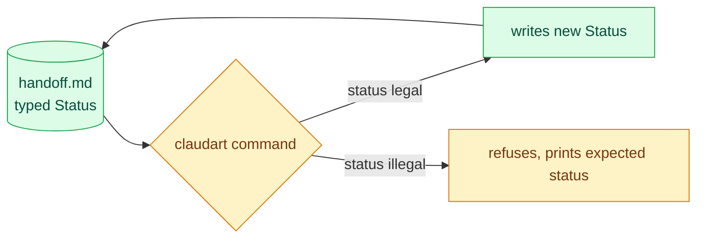
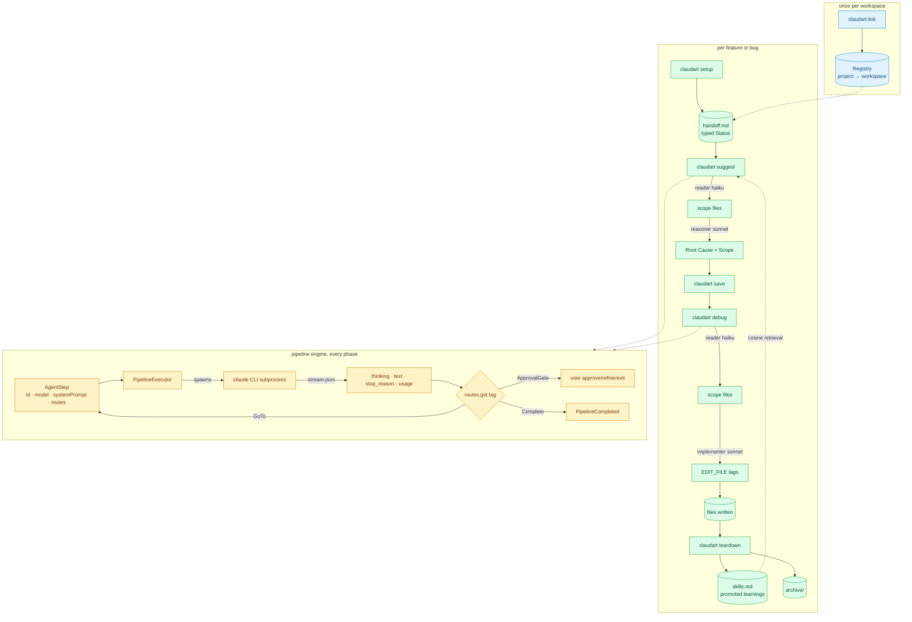
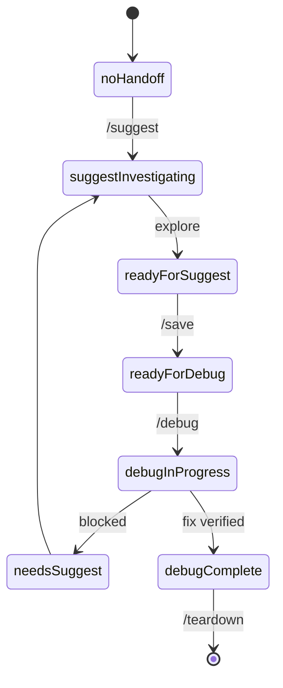
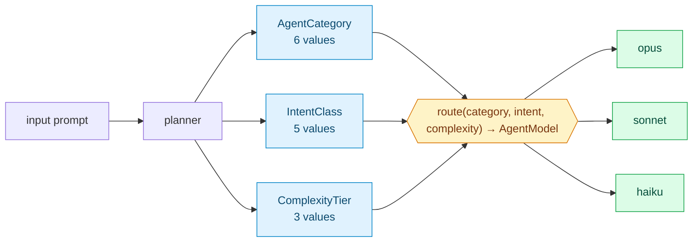
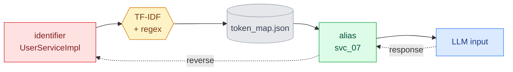
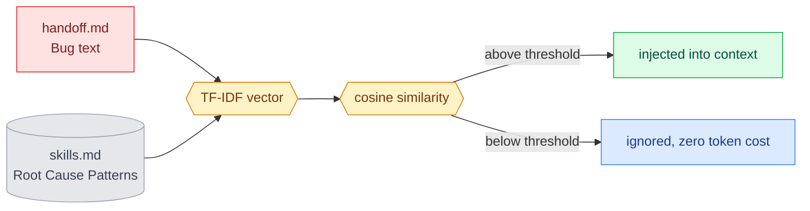
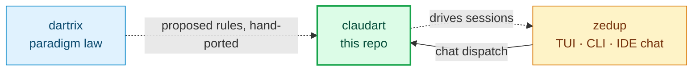

# claudart

**A typed, self-hosting session harness for Claude Code.** claudart manages the state between AI coding sessions so the model always starts already knowing the bug, the scope, and what's been tried. Every session state is an enum. Every model routing decision is a total function. The tool debugs its own bugs using its own workflow.

> Not an Anthropic product. Built for Claude Code + Dart/Flutter projects.
>
> **Deep dive:** [PLAN.md](PLAN.md) carries the full architecture. [docs/design.md](docs/design.md) is the formal FSA proof.

---

## Contents

- [What it is](#what-it-is)
- [How it works](#how-it-works)
- [Proof](#proof), real transcripts, not claims
- [TUI vs CLI](#tui-vs-cli)
- [Full architecture](#full-architecture)
- [Why the typed state matters](#why-the-typed-state-matters)
- [Token efficiency](#token-efficiency)
- [CLI surface](#cli-surface)
- [Skills + retrieval](#skills--retrieval)
- [Authentication](#authentication)
- [Workspace structure](#workspace-structure)
- [Roadmap](#roadmap)
- [Cross-repo](#cross-repo)
- [Related](#related)

---

## What it is

**claudart** is a compiled Dart CLI you run in your terminal. It owns everything *between* sessions: writing structured context before you open your editor, checkpointing discoveries mid-session, abstracting sensitive identifiers before they leave your machine, and extracting learnings when a session ends.

**Claude Code** is the AI assistant in your editor. You drive it through slash commands, `/suggest`, `/debug`, `/save`, `/teardown`. It reads the context claudart wrote, so it never starts a session blind.

| | claudart | Claude Code |
|---|---|---|
| **What** | Dart CLI binary at `~/bin/claudart` | AI assistant in your editor |
| **Where** | terminal | IDE chat panel |
| **You type** | `claudart setup`, `claudart teardown` | `/suggest`, `/debug`, `/save` |
| **It owns** | session state, workspace config, skills, privacy | exploration, fix implementation |
| **Runs on** | your machine only (`~/.claudart/`) | Anthropic servers (reads abstracted context) |

---

## How it works

A session is a state machine, not a chat log. `claudart setup` writes a `handoff.md` with a typed `Status` field. Every command that touches that file reads the status, decides what's legal next, and writes a new status back. There's no free text driving control flow anywhere in the loop.



Under the hood, each phase (`suggest`, `debug`, `flow`) runs a small pipeline of typed steps. A step declares its model, its system prompt, and a routing table mapping the tags it might emit to what happens next. The executor spawns the real `claude` CLI as a subprocess for each step, parses the structured output, and follows the route. Nothing about "what happens after this step" lives in prose or in the model's head. It lives in a `Map<RouteTag, StepRoute>` that compiles.

---

## Proof

<details>
<summary><strong>A real session, start to finish</strong></summary>

This is an actual `claudart setup` → `claudart suggest` → `claudart debug` → `claudart teardown` run against this repo, investigating a real question (does claudart need a runtime dependency on dartrix). Not a demo script. The literal CLI, piped real answers, spawning real `claude` API calls.

```
$ claudart setup
─── claudart ───────────────────────────────
  Branch : feature/bare-string-lint
  Status : ready-for-debug
  ...
  2. Start fresh  overwrite handoff with new context
Previous session archived → handoff_feature_bare-string-lint_2026-09-21T15-20-41.md

1. What is the bug? (actual behavior)
> Does claudart's shipped runtime (lib/) actually depend on dartrix at runtime...
✓ Handoff written to .../handoff.md

$ claudart suggest
  [1] Read files › [2] Reason › [3] Write handoff
  ✓ Result  claudart / reader     in 1.2k · out 890 · $0.014
  ✓ Result  claudart / reasoner   in 3.1k · out 1.4k · $0.041
Root Cause:
  Nothing is broken in the runtime dependency graph. The verdict is (a):
  claudart correctly does not need a runtime dependency on dartrix.
  `pubspec.yaml` lines 23-24 place dartrix in `dev_dependencies` only...

$ claudart debug
  [1] Read files › [2] Implement › [3] Write files
  ✓ Result  claudart / implementer   in 17 · out 5.3k · $0.048
✓ Wrote 1 file: tool/claudart_lints/lib/claudart_lints.dart

$ claudart teardown
✓ Skills updated: .../skills.md
✓ Handoff archived: .../archive/handoff_feature_step-result-metadata_....md
✓ Handoff reset.
```

The fix it wrote landed as a library doc comment on the lint package explaining the exact dependency verdict, unprompted about the specific wording, just given the bug and expected behavior. Verified with `dart analyze` and `dart run custom_lint`, both clean, before commit.

</details>

<details>
<summary><strong>Extended thinking, captured and attributed</strong></summary>

`defaultClaudeRunner` parses the real `--output-format stream-json --include-partial-messages` stream, not just the final summary line. This is a real captured call:

```
text: 9 times 8 equals **72**...
thinking present: true
thinking (first 200 chars): The user is asking me to calculate 9 times 8...
thinkingTokens: 240
stopReason: end_turn
durationMs: 4528
numTurns: 1
usage: Usage(in:9, out:439, cached:10386, cacheWrite:6698, thinking:240, $0.0122881)
```

240 of the 439 output tokens went to reasoning the model never showed in its answer, now attributed and queryable, not silently discarded.

</details>

<details>
<summary><strong>Lint rules catch violations in claudart's own code, live</strong></summary>

`bare_string_for_enum`, `enum_values_loop_in_single_test`, and `ungrouped_identical_switch_cases` are `custom_lint` rules enforcing this repo's own paradigms. They aren't theoretical, they've caught real violations in this codebase during development, including in code being written for this exact tool:

```
lib/pipeline/pipeline_executor.dart:429:3 •
  Switch dispatches on string literals instead of an enum.
  Model these cases as an enum and switch on it. •
  bare_string_for_enum • ERROR
```

That specific violation was in a stream-event parser being added the same session, caught before it shipped, fixed by introducing a typed `_StreamEventType` enum instead of switching on raw JSON strings.

</details>

---

## TUI vs CLI

The same session state renders two ways. `claudart` itself is CLI-only, the transcript in [Proof](#proof) above is its actual terminal output. [zedup](https://github.com/liitx/zedup) hosts a TUI dashboard on top of the same typed `AgentModel`/`StepStatus` claudart ships, no separate model of "what a step is."

Both captures below are real, not mockups. The CLI transcript is a literal `claudart` run, piped verbatim. The TUI panes are captured with [nocterm](https://github.com/liitx/nocterm)'s own headless test renderer (`tester.terminalState.renderToString()`), the same harness zedup's test suite asserts against, run against a literal `AgentsWorkflowState`, not hand-drawn boxes. The capture script lives in zedup's own `tool/` directory (it depends on `package:zedup`, so it can't live here without reintroducing the reverse dependency this repo just removed) — re-run it there after any visual change.

<details>
<summary><strong>zedup's agent pipeline pane — same pipeline, one step waiting on user input</strong></summary>

```
┌──────────────────────────────────────┐
│╭─  agents  ─────────────────────────╮│
││                                    ││
││ [1] Pipeline                       ││
││                                    ││
││  ① reader                hku ✓ --- ││
││  ② reasoner          ops ◉ waiting ││
││  ③ writer                snt ○ --- ││
││                                    ││
││ [2] Context                        ││
││                                    ││
││  status debug-in-progress          ││
││  bug    flaky teardown arch…       ││
││  root   race on handoff.md …       ││
││  scope  teardown_utils.dart        ││
││                                    ││
││ [4] Actions                        ││
││                                    ││
││  running…                          ││
││                                    ││
│╰────────────────────────────────────╯│
└──────────────────────────────────────┘
```

`hku`/`ops`/`snt` are `AgentModel.shortAlias`, `✓`/`◉`/`○` are `StepStatus.glyph`, both owned once by claudart's enums (see [Why the typed state matters](#why-the-typed-state-matters)), not redrawn per-screen.

</details>

<details>
<summary><strong>zedup's dashboard strip — full-width, same three steps</strong></summary>

```
┌────────────────────────────────────────────────────────────────────────────────┐
│────────────────────────────────────────────────────────────────────────────────│
│  ① reader · hku ✓  │ ② reasoner · ops ◉  │ ③ writer · snt ○                    │
│                                                                                │
└────────────────────────────────────────────────────────────────────────────────┘
```

The narrow pane above and this full-width band are two independent widgets rendering the same `AgentsWorkflowState`, split intentionally, the narrow pane fits a fixed 36-char editor column, the band spans the terminal's full width in the standalone dashboard. Both derive glyph and colour from the same `StepStatus` getter, they can't disagree.

</details>

**Step status → glyph → colour.** [`StepStatus`](lib/pipeline/step_status.dart) owns both mappings the captures above use, each an exhaustive switch:

| `StepStatus` | `glyph` | `hue` | meaning |
|---|---|---|---|
| `pending` | `○` | `inactive` | not started |
| `running` | `◉` | `active` | streaming now |
| `waiting` | `◉` | `paused` | escalated, blocked on you |
| `done` | `✓` | `success` | completed |
| `failed` | `✗` | `error` | failed |

`running` and `waiting` deliberately share the `◉` glyph — the TUI tells them apart by `hue`, not shape. `waiting` is the newest variant (2026-09-27): `AgentEscalating`/`AgentResumed` now carry a `stepId` (previously session-level events with no per-step identity), so an escalation drives a real status transition on the step actually blocked, via the [`StepStatusFromEvent`](lib/pipeline/step_status.dart#L57-L74) extension's `fromEvent` — an extension method, not a static on `StepStatus` itself, which is why the call site is `StepStatusFromEvent.fromEvent(event)`, not `StepStatus.fromEvent(event)`. See [`glyph`](lib/pipeline/step_status.dart#L49-L54) and [`hue`](lib/pipeline/step_status.dart#L40-L46) for the exhaustive switches.

---

## Full architecture



Three layers, each independently testable. `Registry` maps a git project to its workspace once, at `link` time. The session layer is the state machine described above, `handoff.md`'s typed status driving what command runs next. The engine layer is shared by every phase, `suggest` and `debug` are both just a specific list of `AgentStep`s handed to the same `PipelineExecutor`.

---

## Why the typed state matters

**`HandoffStatus`** replaces magic strings with an enum. Every transition is typed, every dispatch is an exhaustive switch, adding a new state without updating every switch is a compile error, not a runtime surprise.



[`HandoffStatus`](lib/session/session_state.dart#L7), eight values, exhaustive switch in [`teardown_utils.dart`](lib/session/teardown_utils.dart) and every dispatch site.

**The planner** routes every input on three orthogonal axes to a model, a total function over ninety cells.



- **[`AgentCategory`](lib/pipeline/agents/categorization.dart#L115-L121)**, `feature`, `bug`, `refactor`, `research`, `setup`, `gui`.
- **[`IntentClass`](lib/pipeline/agents/categorization.dart#L141-L146)**, `explore`, `analyze`, `implement`, `document`, `design`. Partition: the five variants cover the whole set.
- **[`ComplexityTier`](lib/pipeline/agents/categorization.dart#L153-L156)**, `atomic`, `compound`, `systemic`. `atomic` and `systemic` never overlap.

6 × 5 × 3 = 90 cells, not 60 — `gui` and `design` are real, shipped axis values.

Four concrete routings:

| Input | Classification | Model |
|---|---|---|
| "implement gap cross-ref in side panel" | `feature × implement × atomic` | `sonnet` |
| "explain how this codebase handles state" | `research × explore × systemic` | `opus` |
| "what does HandoffStatus do" | `research × document × atomic` | `haiku` |
| "review this widget's visual hierarchy" | `gui × design × atomic` | `opus` |

Rules, in [`routeModel`](lib/pipeline/agents/categorization.dart#L179-L204): any `design` intent, or systemic explore/analyze, routes to `opus` for broad reasoning. Any other analyze or implement, or compound explore, routes to `sonnet` for balanced generation. Atomic explore or any document routes to `haiku` for fast lookup. The switch is exhaustive over every one of the 90 combinations.

`AgentModel.fable` (`claude-fable-5-1`) is a real, registered model — `routeModel`'s design branch pointed at it briefly, then reverted to `opus` the same day after comparing output quality directly (`fable` stays available, just isn't the default route for anything today; see PLAN.md's Phase 11 log).

**`StepMode`** is the same discipline applied to how a pipeline step invokes the `claude` CLI. It replaced a raw boolean this session, after live-testing found the boolean flag silently broke OAuth authentication when set. An enum with named variants makes that failure mode a documented case instead of a hidden trap.

---

## Token efficiency

Sensitive identifiers get abstracted before any prompt leaves your machine. The reverse mapping resolves on response.



Same task, unstructured chat versus the claudart pipeline:

| Strategy | Input tokens | Output tokens | Total |
|---|---|---|---|
| Unstructured chat, one big prompt | ~24,000 | ~3,800 | ~27,800 |
| claudart, scaffold once + per-feature handoff | ~6,500 | ~3,200 | ~9,700 |

About 65% reduction. Numbers are typical, not benchmarks.

The suggest pipeline's refinement loop compounds this further. When you ask for a change, the applier step sends and receives only the analysis sections your feedback actually targets, not the full six-section document round-tripped on every pass. If a targeted section doesn't exist yet, it falls back to the full document rather than silently failing to add it, verified with a real regression test, not just an assumption.

---

## CLI surface

```bash
claudart setup          # bootstrap workspace, write handoff.md
claudart status         # show session state
claudart suggest        # run suggest pipeline (agent dispatch)
claudart save           # checkpoint, lock root cause
claudart debug          # run debug pipeline (implement fix)
claudart teardown       # archive, promote skills, suggest commit
claudart teardown --headless  # same, but resolves every decision itself
```

<details>
<summary><strong>The real <code>--help</code> output</strong></summary>

Not retyped by hand — this is `bin/claudart.dart`'s own `_usage` constant (lines 32-74), the literal text printed for `claudart --help` / `claudart -h`:

```
$ claudart --help
claudart — Dart CLI for structured project debug and suggestion sessions

Usage:
  claudart                Run the interactive launcher (list projects, start workflow)
  claudart <command> [arguments]

Commands:
  chat                   Open the interactive chat shell: greeting, then dispatch to flow/suggest
  archives               List session archives for the current project; resume or view snapshots
  add                    Scaffold a brand-new project: PLAN.md, CLAUDE.md, registry entry, .claude symlink, Claude Code memory registration
  init                   Initialize the workspace with generic starter knowledge
  init --project <name>  Add a project knowledge file to the workspace
  link [project-name]    Symlink workspace into current project (detects name from git if omitted)
  unlink                 Remove workspace symlinks from current project
  setup [path]           Start a new session (path defaults to current directory)
  status [--prompt]      Show current session state; --prompt outputs a compact colored string for shell RPROMPT/PS1
  teardown [--headless]  Close session: update knowledge, archive handoff, suggest commit; --headless resolves every decision itself and prints a summary instead of prompting
  suggest                Run suggest pipeline: haiku reads scope files, sonnet writes handoff KT
  flow                   [experimental] Agent-constructed session: classify intent, plan, approve, build handoff
  save                   Checkpoint session: snapshot handoff, deposit confirmed facts to skills
  rotate                 Archive current session, run build gate, seed next handoff from Pending Issues
  kill                   Abandon session: archive handoff, remove symlink (no skills update)
  resume                 Pre-populate setup from the most recent archive entry
  confirm-pending --question <q> --on-confirm <cmd>
                         Set the pending confirmation for this workspace
  confirm-pending --clear  Clear the pending confirmation
  preflight <op>         Sync check before starting an operation (op: debug | save | test)
  scan [--scope lib|full|handoff] [--full]  Re-scan project for sensitive tokens
  report [--file-issue]  Show diagnostic report; --file-issue files GitHub issues
  map                    Generate token_map.md from token_map.json
  experiment <name> -- <cmd> [args]  Run a command and tee output to experiments/<name>_<ts>.ansi
  compile                Recompile the claudart binary and install it to ~/bin/claudart
  version                Print the current claudart version

Options:
  -h, --help       Show this help message
  --version        Print the current claudart version
  --debug          Write per-step trace (system prompt, message, token
                   counts, cost) to $CLAUDART_DEBUG_PATH (default
                   /tmp/claudart_debug.log). Same effect as setting
                   CLAUDART_DEBUG=1.
```

</details>

<details>
<summary><strong>Full command table</strong></summary>

| Command | Role | Code |
|---|---|---|
| `chat` | interactive chat shell, the agentflow front door | [bin/claudart.dart:115](bin/claudart.dart#L115) |
| `archives` | list session archives, resume or view | [bin/claudart.dart:117](bin/claudart.dart#L117) |
| `add` | scaffold a brand-new project workspace | [bin/claudart.dart:119](bin/claudart.dart#L119) |
| `init` | workspace initialization | [bin/claudart.dart:121](bin/claudart.dart#L121) |
| `link` | symlink + register + setup sensitivity | [bin/claudart.dart:123](bin/claudart.dart#L123) |
| `unlink` | remove symlinks cleanly | [bin/claudart.dart:125](bin/claudart.dart#L125) |
| `setup` | start session, write handoff.md | [bin/claudart.dart:127](bin/claudart.dart#L127) |
| `status` | session state, compact for shell | [bin/claudart.dart:131](bin/claudart.dart#L131) |
| `teardown [--headless]` | archive, promote skills; `--headless` resolves every decision itself | [bin/claudart.dart:133](bin/claudart.dart#L133) |
| `suggest` | run suggest pipeline | [bin/claudart.dart:137](bin/claudart.dart#L137) |
| `debug` | run debug pipeline | [bin/claudart.dart:139](bin/claudart.dart#L139) |
| `flow` | experimental agent-constructed session | [bin/claudart.dart:141](bin/claudart.dart#L141) |
| `save` | checkpoint session | [bin/claudart.dart:143](bin/claudart.dart#L143) |
| `rotate` | archive, build gate, seed next from Pending Issues | [bin/claudart.dart:145](bin/claudart.dart#L145) |
| `kill` | abandon session, no skills update | [bin/claudart.dart:147](bin/claudart.dart#L147) |
| `resume` | pre-populate setup from the most recent archive | [bin/claudart.dart:149](bin/claudart.dart#L149) |
| `confirmPending` | set or clear the pending confirmation for the current project | [bin/claudart.dart:151](bin/claudart.dart#L151) |
| `preflight <op>` | sync check, debug, save, or test | [bin/claudart.dart:153](bin/claudart.dart#L153) |
| `scan` | rescan for sensitive tokens | [bin/claudart.dart:156](bin/claudart.dart#L156) |
| `report` | diagnostic report, file GitHub issues | [bin/claudart.dart:171](bin/claudart.dart#L171) |
| `map` | generate token_map.md from token_map.json | [bin/claudart.dart:179](bin/claudart.dart#L179) |
| `experiment` | tee command output to experiments/ | [bin/claudart.dart:186](bin/claudart.dart#L186) |
| `compile` | rebuild the binary | [bin/claudart.dart:188](bin/claudart.dart#L188) |
| `version` | print version | [bin/claudart.dart:94](bin/claudart.dart#L94) |

</details>

---

## Skills + retrieval

Skills are persistent learnings extracted by `teardown`. Each is a small markdown entry. On `suggest`, claudart picks the top-k most relevant by cosine similarity over a TF-IDF embedding:

```
score(query, skill) = (q · s) / (‖q‖ · ‖s‖)
```

`q` is the term-frequency vector of the task description, `s` is the same for the skill body. Skills scoring above threshold get injected into context. Below threshold, they're ignored at zero token cost.



[`lib/similarity/cosine.dart`](lib/similarity/cosine.dart)'s `tfidfVector` + `buildIdfCorpus` compute both vectors; [`lib/session/skills_lookup.dart`](lib/session/skills_lookup.dart)'s `relevantSkillPatterns` does the ranking and threshold cut, surfaced in `claudart status`'s "Relevant past patterns" section.

Adding a skill is automatic, `teardown` writes it. Pruning is a manual review step in `claudart rotate`.

---

## Authentication

claudart's pipeline steps spawn the real `claude` CLI as a subprocess and rely on whatever session you're already logged into, the normal `claude login` OAuth flow. Each step gets its own `--session-id` so it doesn't collide with your interactive Claude Code session, but it deliberately does not isolate the config directory, because that copies your credential and the copy goes stale as the OAuth token rotates. Isolating by session, not by config, is what keeps a claudart-driven step authenticated with nothing more than the login you already have.

This is also why no built-in step passes `--bare` to the subprocess. `--bare` is real and useful, minimal mode, skips hooks, LSP, plugin sync, and CLAUDE.md auto-discovery, but it comes with a hard requirement. It reads only `ANTHROPIC_API_KEY` or an `apiKeyHelper`. OAuth and keychain credentials are never read under `--bare`, by design. A normal OAuth session gets `Not logged in` if you try it, verified directly against the live CLI, not assumed.

If you run claudart with `ANTHROPIC_API_KEY` set instead of an OAuth login, both paths work. `defaultClaudeRunner` doesn't touch either credential source itself, it only decides `--session-id` and, when a step opts into `StepMode.bare`, `--bare`.

---

## Workspace structure

<details>
<summary><strong>What lives on disk</strong></summary>

```
~/.claudart/
├── registry.json                # startup reads ONLY this
└── <project>/
    ├── config.json               # owner, stack, knowledge scope
    ├── handoff.md                # active session state
    ├── skills.md                 # promoted learnings
    ├── token_map.json            # identifier → alias map
    ├── archive/                  # rotated session archives
    ├── knowledge/                # generic + per-project knowledge files
    ├── logs/
    │   ├── interactions.jsonl
    │   └── errors.jsonl
    ├── PLAN.md                   # generated by `claudart add`, owned by project
    └── CLAUDE.md                 # generated by `claudart add`, re-generatable
```

</details>

---

## Roadmap

<!-- claudart:link:roadmap -->
<details>
<summary><strong>What's coming</strong></summary>

| Phase | Scope | Status |
|---|---|---|
| 1 | CLI + workspace + scaffold | shipped |
| 2 | Sensitivity mode + token map | shipped |
| 3 | Skills + cosine retrieval | shipped |
| 4 | Static analysis scanner | shipped |
| 5 | Design subagent | deferred, see PLAN.md |
| 6 | Agent flow registry + planner.dart | registry shipped, planner.dart closed (not built, see PLAN.md) |
| 7 | Per-step thinking/cost metadata + routing loop-back signal in the agent pipeline pane | shipped, partial scope (see PLAN.md) |
| 8 | README migration (this generation mechanism) | shipped |

</details>

---

## Cross-repo



claudart runs standalone. It has zero runtime dependency on dartrix, verified by grepping every import in `lib/`, dartrix sits in `dev_dependencies` only, used for test-time matrix coverage. Paradigm enforcement lives in claudart's own `custom_lint` rules, which re-derive dartrix's `PARADIGMS.md` prose by hand. The sync is a process, propose a rule to dartrix, then hand-port the lint, not a code dependency. zedup consumes claudart's slash commands and dispatches through it, but claudart doesn't depend on zedup either.

---

## Related

- **[dartrix](https://github.com/liitx/dartrix)**, the paradigm law. `PARADIGMS.md` defines the rules claudart's `custom_lint` package enforces.
- **[zedup](https://github.com/liitx/zedup)**, TUI dashboard and work tracker. Hosts an in-editor claudart chat panel, dispatches `/suggest`, `/debug`, `/save` through the typed `AgentModel` registry.